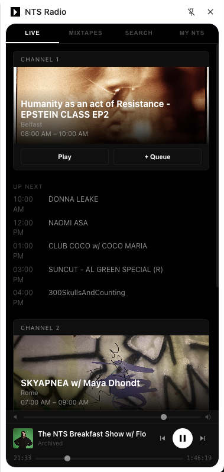
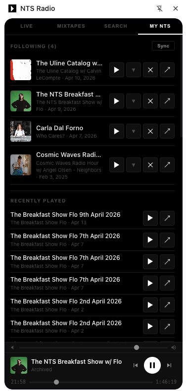
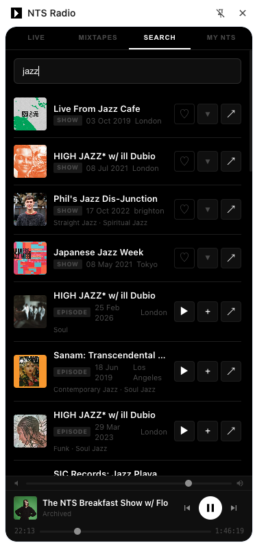

# NTS Radio Chrome Extension

A Chrome side panel extension for [NTS Radio](https://www.nts.live) — listen to live streams, infinite mixtapes, and archived episodes without keeping a tab open.


<p align="center">
  
  
  
</p>

## Features

- **Live Streams** — Listen to Channel 1 and Channel 2 with real-time show info and upcoming schedule
- **Infinite Mixtapes** — Browse and play all 16 curated mixtape streams
- **Archived Episodes** — Search the NTS catalog and play past episodes directly in the extension via HLS
- **Queue** — Build a playlist from any combination of live, mixtape, and archived content
- **My NTS** — Sign in to your NTS account to sync followed shows, browse their episode archives, and track listen history
- **Follow/Unfollow** — Manage your followed shows from search results or the My NTS tab — syncs with your NTS account
- **Listen History** — Plays are recorded to your NTS account and past listens are replayable
- **Persistent Playback** — Audio keeps playing even when the side panel is closed

## Install

1. Clone or download this repo
2. Open `chrome://extensions` in Chrome
3. Enable **Developer mode** (top right)
4. Click **Load unpacked** and select this folder
5. Click the NTS Radio icon in your toolbar to open the side panel

## How It Works

**Audio** runs in an [offscreen document](https://developer.chrome.com/docs/extensions/reference/api/offscreen) so it persists independently of the side panel. Live streams and mixtapes are direct MP3 streams. Archived episodes are resolved from SoundCloud via NTS's API and played as HLS using [hls.js](https://github.com/video-dev/hls.js/).

**Authentication** piggybacks on your existing NTS login. A content script on `nts.live` reads Firebase auth tokens from IndexedDB and the NTS API token from the page, then passes them to the extension. No credentials are stored or transmitted beyond what NTS already has in your browser.

**Firestore** is used for follows, favorites, and listen history — the same backend NTS's own apps use. The extension reads and writes directly via the Firestore REST API using your existing auth tokens.

## Project Structure

```
manifest.json      — Extension manifest (MV3)
background.js      — Service worker: player state, auth, Firestore operations
offscreen.html/js  — Hidden audio element + hls.js for persistent playback
sidepanel.html/js  — Main UI: tabs, search, queue, player controls
sidepanel.css      — Dark theme styles
content.js         — Extracts Firebase auth + API token from nts.live pages
firestore.js       — Firestore REST API helpers (query, create, delete)
hls.min.js         — hls.js library for HLS audio playback
icons/             — Extension icons
```

## NTS API

This extension uses NTS's undocumented public API at `https://www.nts.live/api/v2/`:

| Endpoint | Auth | Description |
|---|---|---|
| `/live` | No | Current shows on Channel 1 & 2 |
| `/mixtapes` | No | All infinite mixtape streams |
| `/search?q=...` | No | Search shows and episodes |
| `/shows/{alias}` | No | Show details + recent episodes |
| `/shows/{alias}/episodes` | No | Paginated episode list |
| `/resolve-stream?url=...` | Basic | Resolves SoundCloud URL to HLS stream |

Firestore collections (`nts-ios-app` project):
- `favourites` — Followed shows and favorited episodes
- `archive_plays` — Listen history

## License

MIT
